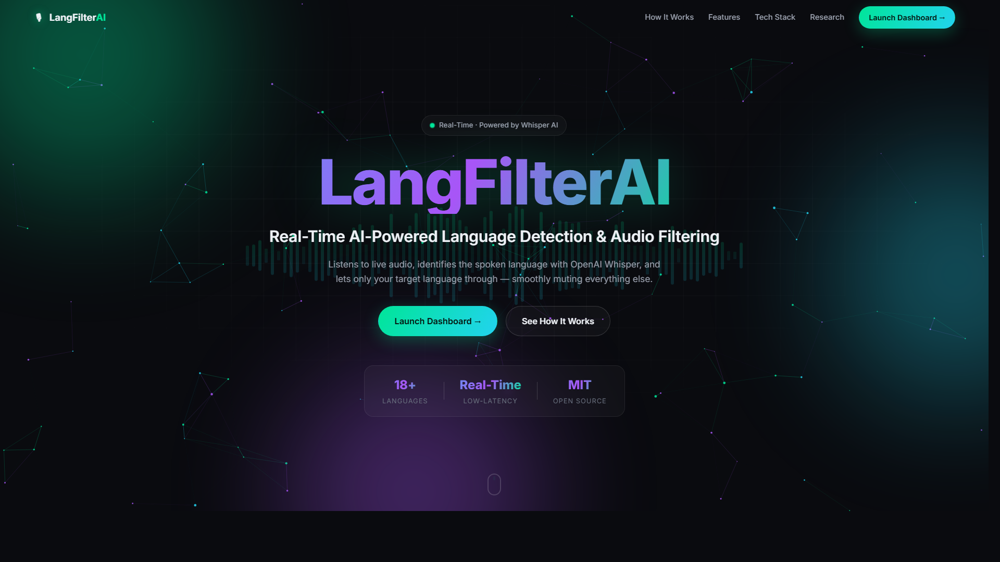
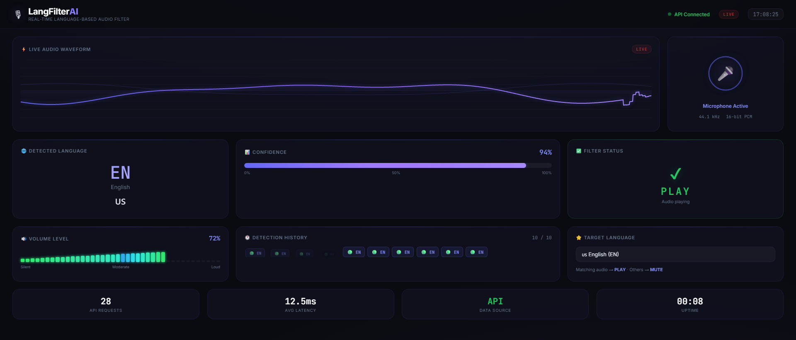
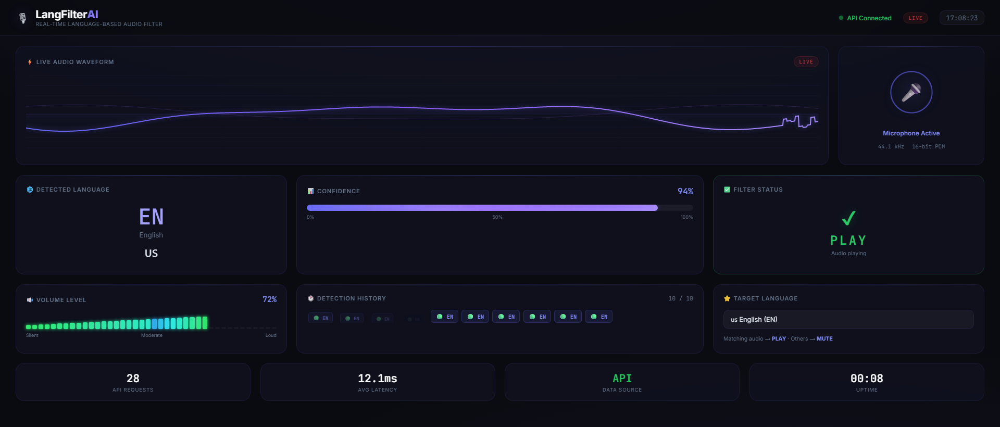
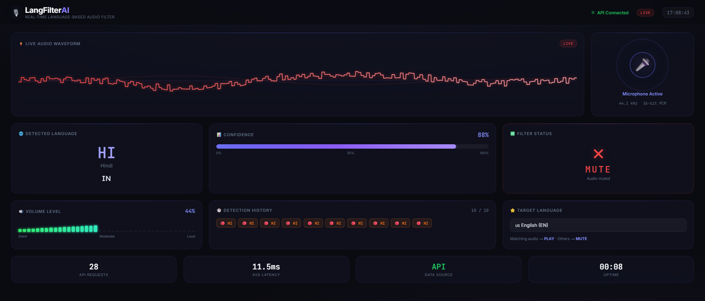
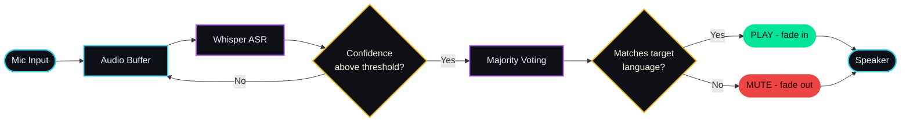
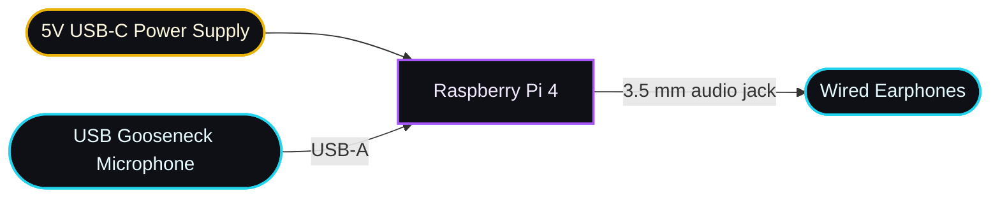
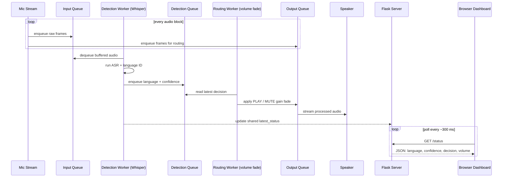
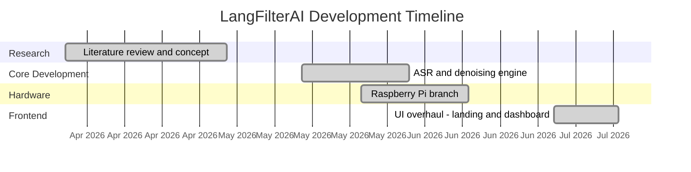

# LangFilterAI — Real-Time Language-Based Audio Filter

> Listens to live audio, identifies the spoken language with OpenAI Whisper, and lets only your target language through — smoothly muting everything else.

<p align="center">
  <a href="LICENSE"></a>
  
  <a href="https://github.com/rajdeep5901/Lang-Filter-AI/issues"></a>
</p>

<p align="center">
  
</p>

---

## 📖 What is LangFilterAI?

LangFilterAI is a real-time audio filter that decides, moment to moment, whether the language currently being spoken should be heard or silenced. Audio is captured live from a microphone, transcribed by an OpenAI Whisper model for spoken-language identification, and compared against a user-selected target language. When the detected language matches the target, the audio passes through; when it does not, the output is faded smoothly to silence.

The system is built around a low-latency, multi-threaded pipeline. A capture thread continuously buffers microphone input, a detection worker runs Whisper inference and applies confidence thresholding plus majority voting to stabilize noisy predictions, and a routing worker applies a gradual volume fade so transitions never click or pop. A lightweight Flask server exposes the live state as JSON, which the browser dashboard polls several times per second to visualize detection, confidence, volume, and the current PLAY/MUTE decision.

This project is a **Final Year Research Project**. It exists both as a working application and as a study of the practical engineering required to turn a batch-oriented speech model into a responsive, streaming, decision-making filter — covering audio buffering, voice activity, confidence calibration, and producer–consumer concurrency.

---

## 🖼️ Screenshots

### Before

The project began as a single real-time dashboard page.

<p align="center">
  
</p>

### After

A dedicated landing page now fronts the project, and the dashboard was refined into two clearly distinguished operating states.

**Landing page**

<p align="center">
  
</p>

**Dashboard — PLAY (target language detected)**

<p align="center">
  
</p>

**Dashboard — MUTE (non-target language detected)**

<p align="center">
  
</p>

---

## 🌐 Live Demo

| Resource | URL | Notes |
| --- | --- | --- |
| Landing page | `https://rajdeep5901.github.io/Lang-Filter-AI/` | Static landing page, hosted free on GitHub Pages. |
| Dashboard | `http://localhost:5000/dashboard` | Requires the local Flask backend, a microphone, and the Whisper model. |

The landing page is purely static and is served from GitHub Pages (see the [Deployment Guide](#-deployment-guide) below). The dashboard is a live view of the detection backend, so it needs the Flask server running locally with microphone access — it cannot function as a hosted, backend-less demo.

---

## 🚢 Deployment Guide

The landing page (`index.html` and its assets) is fully static, so it is deployed with **GitHub Pages** — GitHub's built-in static hosting. This is the recommended platform for this project: it is **free for public repositories with no hidden costs**, requires no separate account or build pipeline, and serves the site directly from the branch.

### 1. Enable GitHub Pages

From the repository on GitHub:

1. Open the repository **Settings**.
2. In the left sidebar, select **Pages**.
3. Under **Build and deployment → Source**, choose **Deploy from a branch**.
4. Set **Branch** to **`main`**.
5. Set the folder to **`/ (root)`** — the landing page lives at the repository root.
6. Click **Save**.

GitHub then builds and publishes the site. The first deploy usually takes a minute or two.

### 2. Expected URL

Once published, the landing page is available at:

```
https://rajdeep5901.github.io/Lang-Filter-AI/
```

The URL follows the `https://<username>.github.io/<repository>/` pattern, so it resolves to the repository owner (`rajdeep5901`) and repository name (`Lang-Filter-AI`).

### 3. ⚠️ Important: the dashboard is NOT hosted online

**GitHub Pages hosts the landing page only.** The interactive dashboard cannot run from the hosted URL, because it is a live view of a backend that must talk to your computer's hardware.

To actually use the dashboard you **have to clone the repository and run the server on your own machine**:

```bash
git clone https://github.com/rajdeep5901/Lang-Filter-AI.git
cd Lang-Filter-AI
python server.py
```

Then open `http://localhost:5000/dashboard`.

This local step is **required** — not optional. The dashboard connects to your **local hardware (microphone and speakers)** through the Flask backend in `server.py`, which captures live audio, runs Whisper language detection, and streams the filtered result back out. GitHub Pages serves only static files; it cannot access a microphone, run Python, or reach the audio pipeline. The browser dashboard polls the backend at `window.location.origin`, so it only works when it is served from the local server you started with `python server.py`. In short: **the landing page lives online, but the working dashboard always runs locally.**

### 4. Verify the deployment

- **Landing page (online):** Open `https://rajdeep5901.github.io/Lang-Filter-AI/` in a browser. The neon landing page should load with its styling, animations, and images intact. In the repository, **Settings → Pages** shows a green “Your site is live at …” banner, and the **Deployments** section / **github-pages** environment in the repo's main page records a successful publish.
- **Dashboard (local):** Run `python server.py`, open `http://localhost:5000/dashboard`, and confirm the header status indicator reads **API Connected**. If it shows **API Disconnected**, the local server is not running — the hosted URL will never show a connected dashboard by design.

---

## 🏗️ System Architecture



---

## 🔌 Hardware Setup

Beyond running on a laptop or desktop, LangFilterAI is designed to operate as a self-contained appliance on a Raspberry Pi, so the filter can run without a host computer. The reference setup used during development on the `raspberry-pi` branch is shown in the photograph below.

The physical connections are straightforward and use only the ports built into the board:

- **Power** — A 5V USB-C power supply feeds the Raspberry Pi and boots it directly into the audio pipeline.
- **Audio input** — A USB gooseneck microphone plugs into one of the Pi's USB-A ports and acts as the live capture device. Because it is a USB audio device, it is recognised by the system without additional drivers or a separate sound card.
- **Audio output** — A pair of wired earphones connects to the Pi's 3.5 mm headphone jack and plays back the filtered result. Headphones are preferred over open speakers so that the output cannot loop back into the microphone and trigger false detections.

Once powered on, the Pi launches the Flask backend and the producer–consumer audio pipeline automatically. Audio captured from the USB microphone is transcribed, matched against the target language, and either passed through or faded to silence before it reaches the earphones — the entire detection loop runs locally on the board.




---

## 🧵 Threading Architecture

The backend is a producer–consumer pipeline: audio flows through queues between independent worker threads, so slow Whisper inference never blocks capture or playback. The Flask server reads a shared status object and serves it to the browser dashboard.



---

## ✨ Features

- Real-time spoken-language detection across 18+ languages, including English, Hindi, Odia, Bengali, Tamil, Telugu, Spanish, French, Japanese, and Chinese.
- Streaming, low-latency pipeline that keeps capture and playback responsive during inference.
- OpenAI Whisper (via faster-whisper) for robust multilingual identification.
- Confidence thresholding plus majority voting to suppress noisy, uncertain switches.
- Smooth volume fading so muted and unmuted transitions never click or pop.
- Live browser dashboard with waveform, confidence, volume, detection history, and runtime target-language switching.
- Runtime target-language changes through the Flask API, with no restart required.
- Fully open source under the MIT license.

---

## 🧰 Tech Stack

| Component | Technology | Purpose |
| --- | --- | --- |
| Speech recognition | faster-whisper (Whisper / CTranslate2) | Transcription and spoken-language identification |
| Audio I/O | sounddevice (PortAudio) | Real-time microphone capture and playback |
| Numerical processing | NumPy | Buffer math, RMS volume, array handling |
| Backend server | Flask + Flask-CORS | Status API and static frontend serving |
| Concurrency | threading + queue | Producer–consumer real-time pipeline |
| Frontend | Vanilla HTML / CSS / JavaScript | Landing page and live dashboard (no build step) |
| Typography | Inter + JetBrains Mono | Interface and monospace fonts |

---

## 🚀 Getting Started

### Prerequisites

- Python 3.9 or newer
- A working microphone and speakers or headphones
- PortAudio (native dependency of `sounddevice` — see step 3)
- Roughly 1–2 GB of disk space for the Whisper model on first run

### Steps

1. **Clone the repository**

   ```bash
   git clone https://github.com/rajdeep5901/Lang-Filter-AI.git
   cd Lang-Filter-AI
   ```

2. **Create and activate a virtual environment**

   ```bash
   python -m venv venv
   # Windows
   venv\Scripts\activate
   # macOS / Linux
   source venv/bin/activate
   ```

3. **Install PortAudio** (native library required by `sounddevice`)

   | Operating system | Command |
   | --- | --- |
   | Windows | Bundled with the `sounddevice` wheel — usually no separate step; if needed, `conda install portaudio` |
   | macOS | `brew install portaudio` |
   | Debian / Ubuntu | `sudo apt-get install libportaudio2 portaudio19-dev` |
   | Fedora | `sudo dnf install portaudio portaudio-devel` |

4. **Install Python dependencies**

   ```bash
   pip install faster-whisper sounddevice numpy flask flask-cors
   ```

5. **Start the server**

   ```bash
   python server.py
   ```

   The Whisper model downloads automatically the first time and the audio backend starts in a background thread.

6. **Open the app**

   Visit `http://localhost:5000` for the landing page, then `http://localhost:5000/dashboard` for the live dashboard.

---

## 🎛️ How to Use

1. Start the server with `python server.py` and wait for the model to finish loading.
2. Open `http://localhost:5000/dashboard` in your browser.
3. Confirm the status indicator reads **API Connected** in the header.
4. Choose your target language from the **Target Language** selector.
5. Speak, or play audio, into the microphone and watch the detected language and confidence update live.
6. Observe the **Filter Status** card: it shows **PLAY** while the target language is spoken and **MUTE** for any other language.

---

## 🩺 Troubleshooting

| Error / Symptom | Cause | Fix |
| --- | --- | --- |
| `OSError: PortAudio library not found` | PortAudio native library missing | Install PortAudio for your OS (see Getting Started step 3), then reinstall `sounddevice`. |
| `No input device` / no audio detected | No default microphone, or OS blocked mic access | Connect a microphone, set it as default, and grant the terminal microphone permission in OS privacy settings. |
| `ModuleNotFoundError: No module named 'faster_whisper'` | Dependencies not installed or wrong environment | Activate the virtual environment and run the `pip install` command from step 4. |
| Very slow first run | Whisper model is downloading and caching | Wait for the one-time download; later runs load from cache and start quickly. |
| High CPU usage | Whisper inference is compute-heavy on CPU | Use a smaller model size, increase the detection interval, or run on a machine with a supported GPU. |
| Dashboard shows "API Disconnected" / CORS error | Server not running, or opened from a different origin | Start `server.py` and open the dashboard from `http://localhost:5000` so it shares the Flask origin (CORS is already enabled). |
| Audio echo or feedback | Speaker output is looping back into the microphone | Use headphones instead of speakers, or lower the output volume. |

---

## 📚 Research Papers

| Paper | Authors | Relevance |
| --- | --- | --- |
| [Robust Speech Recognition via Large-Scale Weak Supervision (Whisper)](https://arxiv.org/abs/2212.04356) | Radford, Kim, Xu, Brockman, McLeavey, Sutskever (OpenAI) | The ASR and language-identification model at the core of LangFilterAI. |
| [Distil-Whisper: Robust Knowledge Distillation via Large-Scale Pseudo Labelling](https://arxiv.org/abs/2311.00430) | Gandhi, von Platen, Rush (Hugging Face) | Smaller, faster distilled Whisper — a route to lower-latency real-time filtering. |
| [Spoken Language Recognition: From Fundamentals to Practice](https://doi.org/10.1109/JPROC.2013.2237151) | Li, Ma, Lee (Proceedings of the IEEE, 2013) | Survey of spoken-language identification, the task underlying the filter's decisions. |

---

## 🧠 Key Concepts

| Concept | Why It Matters |
| --- | --- |
| Voice Activity Detection (VAD) | Distinguishes speech from silence and noise so inference runs on meaningful audio, saving compute and reducing false detections. |
| Connectionist Temporal Classification (CTC) | A sequence-alignment objective foundational to end-to-end speech models, enabling transcription without frame-level labels. |
| Nyquist Theorem | A signal must be sampled at least twice its highest frequency; it dictates the 16 kHz sample rate that Whisper expects for speech. |
| Majority Voting | Aggregating several recent detections and taking the most common one smooths out single-frame errors and prevents rapid flip-flopping. |
| Confidence Threshold | Ignoring predictions below a confidence cutoff avoids acting on uncertain guesses, trading a little latency for stability. |
| Producer–Consumer Threading | Decoupling capture, inference, and playback through queues keeps slow model inference from blocking real-time audio flow. |

---

## 📅 Project Timeline



---

## 📂 Project Structure

```text
Lang-Filter-AI/
├── ASR_plus_denoising.py          # Standalone ASR + denoising prototype
├── ASR_plus_denoising_test.py     # Real-time backend: Whisper, threading, queues, voting
├── server.py                      # Flask server: /status, /config, /set_target, page routes
├── index.html                     # Landing page
├── dashboard.html                 # Live real-time dashboard
├── app.js                         # Dashboard logic (polls /status via window.location.origin)
├── style.css                      # Dashboard styles
├── landing.css                    # Landing page styles
├── landing.js                     # Landing animations (constellation, waveform, scroll reveals)
├── screenshots/                   # Images used in this README
├── AGENTS.md                      # Contributor / agent notes
├── LICENSE                        # MIT license
└── .gitignore
```

---

## 🌿 Branches

| Branch | Target Hardware | Description |
| --- | --- | --- |
| `main` | Laptop / Desktop | Primary stable branch: landing page, live dashboard, and the Whisper detection backend. |
| `soft-audio-enhancement` | Laptop / Desktop | Experimental branch tuning soft audio enhancement and denoising behavior. |

---

## 🤝 Contributing

Contributions are welcome.

1. Fork the repository.
2. Create a feature branch: `git checkout -b feature/your-feature`.
3. Commit your changes: `git commit -m "Add your feature"`.
4. Push the branch: `git push origin feature/your-feature`.
5. Open a Pull Request describing the change and its motivation.

For larger changes, please open an issue first to discuss the approach.

---

## 📄 License

Released under the [MIT License](LICENSE). You are free to use, modify, and distribute this software with attribution.

---

## 👤 Author

**Rajdeep Mohanty** — [github.com/rajdeep5901](https://github.com/rajdeep5901)

Final Year Research Project.
